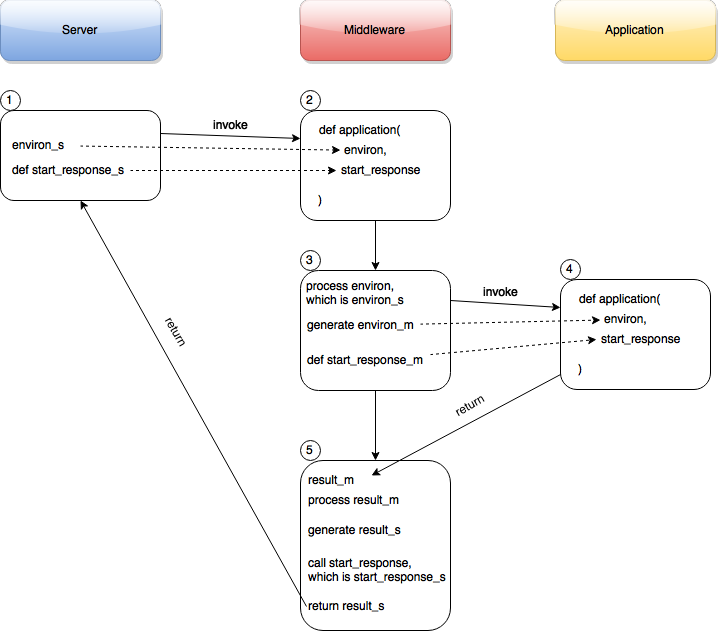

# http和wsgi

之前在项目中，由于直接访问Kibana的页面并点击dashboard时,任何人都可以对已经保存好的dashboard进行修改，因此需要建立一个Web app将Kibana的dashboard展示出来。

在实现过程中选择了SQLite+BootStrap+Flask+uWSGI+Nginx的组合。使用SQLite作为数据库，Flask作为Web后端框架，BootStrap作为前端框架，uWSGI作为部署到CentOS上时使用的实际生产运行环境，Nginx作为反向代理服务器。本篇文章是在实现的过程中，对基于Python语言的Web后端框架Flask，在实现时所使用的HTTP协议和WSGI接口进行简单的介绍。

## HTTP是什么

HTTP全称HyperText Transfer Protocol，中文翻译是超文本传输协议。顾名思义，是一个用来传输HTML(超文本标记语言——HyperText Markup Language)的协议。HTML描述了一个网页里的内容，当然我们在编写网站的时候还会用到CSS来描述网页里的组件的展示效果，用JavaScript来定义网页组件的一些功能。

HTTP协议是一个无状态、无连接的协议。无状态这意味着HTTP协议对事务处理没有记忆能力，只能从客户端向服务器发起请求后，服务器才能作出响应，服务器不能无缘无故地作出响应。无连接意味着每次连接只处理一个请求，服务器在处理完客户端的请求，并收到了应答之后，就会断开连接。

## HTTP被用在什么地方

OSI参考是由ISO制定的，用于计算机或通信系统之间相互连接的标准。下面的表格是不同协议在OSI 7层模型中的位置：

由上表我们可以看到，HTTP被归类到应用层的协议中。应用层是OSI参考模型中的最高层，主要负责实现应用程序和系统的接口，以及直接向用户提供服务，例如文件服务、目录服务、文件传输服务（FTP）、远程登录服务（Telnet）、电子邮件服务（E-mail）等。

目前在互联网中最为常用的TCP/IP协议（Transmission Control Protocol/Internet Protocol）则是对OSI模型进行的一个简化。该协议采用了4层的层级结构，定义了电子设备如何连入互联网，以及数据如何在电子设备之间传输。

1. 应用层:例如**HTTP**、SMTP、SNMP、FTP、Telnet、SIP、SSH、NFS、RTSP、XMPP、Whois、ENRP|
2. 表示层:例如XDR、ASN.1、SMB、AFP、NCP
3. 会话层:例如ASAP、TLS、SSH、ISO 8327 / CCITT X.225、RPC、NetBIOS、ASP、Winsock、BSD sockets
4. 传输层:例如TCP、UDP、RTP、SCTP、SPX、ATP、IL
5. 网络层:例如IP、ICMP、IGMP、IPX、BGP、OSPF、RIP、IGRP、EIGRP、ARP、RARP、 X.25
6. 数据链路层:例如以太网、令牌环、HDLC、帧中继、ISDN、ATM、IEEE 802.11、FDDI、PPP
7. 物理层:例如线路、无线电、光纤、信鸽

上面是OSI模型和TCP/IP模型的一个对应关系，从上图我们可以看见。TCP/IP协议中，将应用层、表示层、会话层合并为应用层，数据链锯层和物理层合并为网络接口层。而HTTP协议在TCP/IP协议中的应用层，功能不变。

目前比较热门的HTTPS协议（Hyper Text Transfer Protocol over Secure Socket Layer），则是HTTP协议和SSL协议的结合。HTTPS协议使用具有安全性的SSL协议，对传输的数据进行加密，改善了HTTP协议使用明文传输的缺陷。

## HTTP消息由什么构成

HTTP是一个基于请求和响应模式的协议。HTTP消息由客户端发送给服务器的请求和服务器发给客户端的响应组成。而请求消息和响应信息都有一个共同的结构：开始行、消息报头、空行、消息正文。其中在请求消息中，开始行被称为请求行；在响应消息中，开始行被称为响应行。

以访问百度为例。一开始我们在浏览器中输入<http://www.baidu.com>并访问，就会先与百度的服务器建立连接，然后向百度的服务器发送一个请求消息。下面表格中的内容是请求消息中的请求行和请求报头，请求消息正文为空。

<table>
	<tr>
		<th>Key</th>
		<th>值</th>
	</tr>
	<tr>
		<th>要求</th>
		<th>GET / HTTP/1.1</th>
	</tr>
	<tr>
		<th>User-Agent</th>
		<th>Mozilla/5.0 (Windows NT 6.1; WOW64; Trident/7.0; rv:11.0) like Gecko</th>
	</tr>
	<tr>
		<th>Host</th>
		<th>www.baidu.com</th>
	</tr>
	<tr>
		<th>Cookie</th>
		<th>略</th>
	</tr>
	<tr>
		<th>Connection</th>
		<th>Keep-Alive</th>
	</tr>
	<tr>
		<th>Accept-Language</th>
		<th>ja-JP</th>
	</tr>
	<tr>
		<th>Accept-Encoding</th>
		<th>gzip, deflate, peerdist</th>
	</tr>
	<tr>
		<th>Accept</th>
		<th>text/html, application/xhtml+xml, */*</th>
	</tr>
</table>

在收到我们的请求消息之后，百度的服务器作出响应，向我们返回响应信息，下面表格中的内容是响应消息中的响应行和响应报头。响应正文则是我们会在浏览器上看到的网页的前端代码。

<table>
	<tr>
		<th>Key</th>
		<th>值</th>
	</tr>
	<tr>
		<th>响应</th>
		<th>HTTP/1.1 200 OK</th>
	</tr>
	<tr>
		<th>X-Ua-Compatible</th>
		<th>IE=Edge,chrome=1</th>
	</tr>
	<tr>
		<th>Transfer-Encoding</th>
		<th>chunked</th>
	</tr>
	<tr>
		<th>Set-Cookie</th>
		<th>略</th>
	</tr>
	<tr>
		<th>Server</th>
		<th>BWS/1.1</th>
	</tr>
	<tr>
		<th>Content-Type</th>
		<th>text/html;charset=utf-8</th>
	</tr>
	<tr>
		<th>Connection</th>
		<th>Keep-Alive</th>
	</tr>
	<tr>
		<th>Cache-Control</th>
		<th>private</th>
	</tr>
</table>

浏览器接受响应消息后，读取响应正文，并将其展示在浏览器上。由于在请求头中“Connection”字段的值为“Keep Alive”，所以该请求使用了一个持久连接，不会马上断开。

对HTTP报头中相关字段的详细定义，可以参考链接：<https://developer.mozilla.org/zh-CN/docs/Web/HTTP/Headers>

## WSGI是什么

WSGI全称是Web Server Gateway Interface， 被译为服务器网关接口，是Python应用程序或Web框架与服务器进行连接时使用的接口。

在Python Web开发中，服务端程序可以被分为服务器程序和应用程序。其中服务器程序负责接受、整理客户端发送来的请求，处理HTTP协议层面的内容，然后发送给应用程序。应用程序负责对服务器程序传来的客户端请求进行处理。而不同的服务器程序和应用程序之间有不同的接口和功能，因此WSGI的存在就是作为一个开发标准，规范双方的接口和功能，使他们能够相互配合，正常运作。

## WSGI规定了什么

在WSGI的规范下，Web组件被分为应用程序、服务器程序和中间件。

### WSGI应用程序(application/framwork)

WSGI规定应用程序可以被服务器程序调用的对象可以是：一个方法、一个实现__call__()方法的类以及该类的实例。WSGI规定该类需要接受两个参数：environ和start_response，并返回一个可迭代的参数。

	def simple_app(environ, start_response):  
	status = '200 OK' 
	response_headers = [('Content-type', 'text/plain')]  
	start_response(status, response_headers)  
	return ['hello, world'] 

其中`environ`是一个字典类型的参数，`environ`中存放了所有和客户端相关的信息，以CGI规范要求的字段、WSGI新增的一些字段存储，除此之外可能还会包含操作环境和服务器相关的信息。

`start_response`是一个可调用对象，它接收`status`和`response_headers`（有时候还有`exc_info`）。 `Status` 和`response_headers` 分别是HTTP响应信息的状态和头部。 当它被调用时， 会向服务器应用程序返回HTTP响应信息的状态和头部。

应用程序对象返回的可迭代对象等于HTTP响应信息中的消息正文(body)。服务器应用程序可以通过遍历这个可迭代对象来获得消息正文中的全部内容。
当应用程序根据`environ`内的信息执行完业务逻辑之后，向服务器应用程序返回信息之前，会先调用`start_response()`，同时也是告诉服务器应用程序接下来要返回HTTP响应信息中的消息正文了。

### WSGI服务器程序(server/gateway)

WSGI规定调用应用程序的服务器程序，应该在调用应用程序前，设定应用程序所需的参数`environ` 和`start_response`。对应用程序返回的结果迭代访问，封装成HTTP响应后传回客户端。

	def run(application):     #服务器程序调用应用程序  
		environ = {}     #设定参数  

		def start_response(xxx):     #设定参数  
			pass  
		result = application(environ, start_response)   
	#调用应用程序的__call__函数（这里应用程序是一个类）  
		def write(data):  
			pass  
		def data in result:          #迭代访问  
			write(data) 

### 中间件(Middleware)

中间件是一个介于服务器程序和应用程序之间的部分，它对服务器程序和应用程序是透明的。对服务器程序而言，中间件就是应用程序；对应用程序而言，中间件就是服务器程序。例如，服务器程序获取到客户端请求的URL，并将其发送给中间件。中间件则将URL发送给应用程序中不同的方法执行。

因此在对中间件进行开发的时候，中间件需要满足WSGI对应用程序和对服务器程序的要求：

1.	中间件需要伪装成应用程序 -> WSGI应用程序的要求 -> 1.可调用 2.接受两个参数 3. 返回一个可迭代的结果
2.	中间件需要伪装成服务器程序 -> WSGI服务器程序的要求 -> 1.调用应用程序

上图粗略解释了中间件的工作流程：

* Sever 收到Client发来的请求，根据请求生成environ_s，sever本身定义的start_response_s。
* Sever调用Middleware的application对象，传递的参数是environ_s和start_response_s。
* Middleware根据environ_s执行业务逻辑，生成environ_m。Middleware本身已定义了start_response_m。
* Middleware调用Application中的application对象，传递的参数是environ_m和start_response_m。Application中的application对象处理完成后，调用start_response_m方法，并向Middleware返回result_m。
* Middleware对result_m进行处理，生成result_s。然后调用start_response_s方法，并将result_s发给Sever。
* Sever将收到的result_s封装成HTTP响应信息返回给客户端。

## WSGI的实现和部署

要使用WSGI进行Web开发，需要分别实现应用程序和服务器程序。

对于应用程序，通常会使用Python的各种框架实现，如Django、Flask、web.py等。框架会内部实现WSGI，提供接口让开发者获取HTTP请求的内容以及发送HTTP响应。

对于服务器程序，由于一般常用的Web服务器，如Apache和Nginx，都不会内置对WSGI的支持，因此需要通过拓展模块实现。比如Apache服务器，会通过扩展模块mod_wsgi来支持WSGI。Apache和mod_wsgi之间通过程序内部接口传递信息，mod_wsgi会实现WSGI的server端、进程管理以及对application的调用。Nginx上一般是用proxy的方式，用nginx的协议将请求封装好，发送给应用服务器，比如uWSGI，应用服务器会实现WSGI的服务端、进程管理以及对application的调用。

